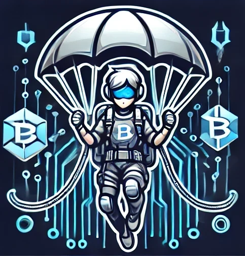
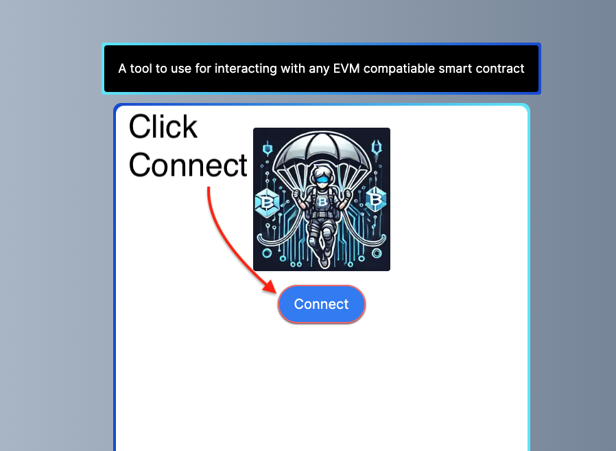
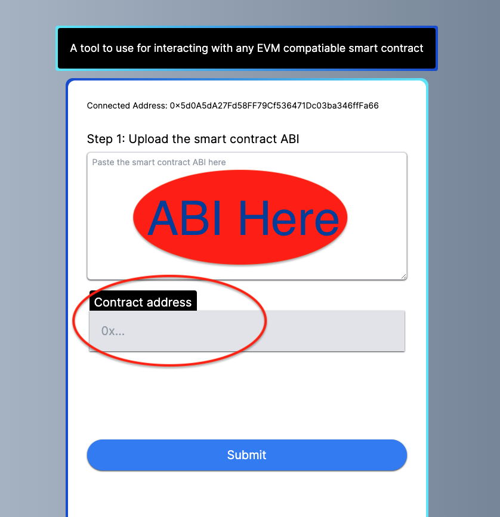
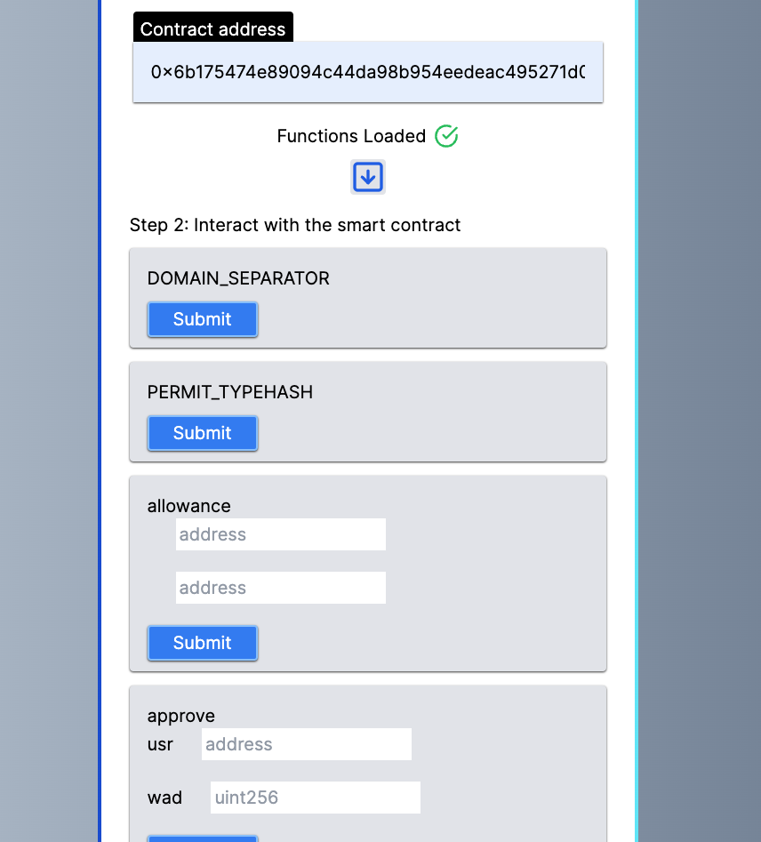

# Rip Cord
## Deployed on Vercel [Here](https://rip-cord.vercel.app/)


## An app that works on any EVM compatiable blockchain and allows you to load all available functions and call them. 
## After cloning repo, start the NextJS app with the following command from a terminal at the root of the project
```
npm run dev
```
### Step 1 Connect your metamask wallet by clicking the connect button (Must connect your Metamask wallet)


### Step 2 is to load the ABI by copy/paste and copy/paste the contract address into the form in the app


### Step 3 Click the submit button

### Smart Contract function will be loaded and callable



This is a [Next.js](https://nextjs.org/) project bootstrapped with [`create-next-app`](https://github.com/vercel/next.js/tree/canary/packages/create-next-app).

Check out our [Next.js documentation](https://nextjs.org/docs) for more details.
